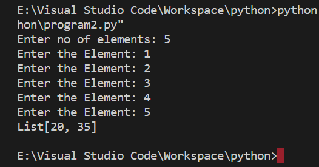

# PYTHON_PROGRAMMING (CSA0839)

## DAY-1:

[program1.py](program1.py) - Checking 2 strings for isomorphic

[program2.py](program2.py) - Sum of square of both odd and even numbers

[program3.py](program3.py) - Checking for happy number

[program4.py](program4.py) - Checking for palindrome

[program5.py](program5.py) - prices of day old and new loaves

[program6.py](program6.py) - largest area between 2 points

[program7.py](program7.py) - A string s is lexicographically sorted combination is printed

[program8.py](program8.py) - valid integers and decimals

[program9.py](program9.py) - cruise with guests entering and leaving count at time T

[program10.py](program10.py) - letters replaced by moving n steps forward where n is the repetition 

---

## DAY-2:

[program11.py](program11.py) - staircase program

[program12.py](program12.py) - Leap year or not

[program13.py](program13.py) - maximum no of words found in sentences

[program14.py](program14.py) - merge 2 sorted list

[program15.py](program15.py) - basic calculator

[program16.py](program16.py) - dialer program

[program17.py](program17.py) - pattern with parantheses

[program18.py](program18.py) - regular expression matching with * and .

[program19.py](program19.py) - divding month and year into season

[program20.py](program20.py) - to remove words that are common in 2 strings

---

## DAY-3:

[program21.py](program21.py) - daily share marketing

[program22.py](program22.py) - all combination of 3 digit number

[program23.py](program23.py) - no of good pair in array

[program24.py](program24.py) - sum of 2 binary numbers

[program25.py](program25.py) - no of steps made forward

[program26.py](program26.py) - mirror view of the number

[program27.py](program27.py) - unique permutation

[program28.py](program28.py) - Anagram

[program29.py](program29.py) - expression matching

[program30.py](program30.py) - min no of operation need to change one word to another

---

## DAY-4:

[program31.py](program31.py) - fizzbuzz question

[program32.py](program32.py) - no of student users

[program33.py](program33.py) - numbers smaller than current number

[program34.py](program34.py) - palindrome or not 

[program35.py](program35.py) - min no of steps

[program36.py](program36.py) - delete repetion in string

[program37.py](program37.py) - lexographically sorted

[program38.py](program38.py) - roman number to integer 

[program39.py](program39.py) - season with month an date

[program40.py](program40.py) - string is scrambled or not

---

## DAY-5:

[program41.py](program41.py) - no of letters in last word

[program42.py](program42.py) - total salary with bonus

[program43.py](program43.py) - least sum of perfect nmber is equal to n

[program44.py](program44.py) - no of integers divide both numbers

[program45.py](program45.py) - index of max element in a list

[program46.py](program46.py) - 

[program47.py](program47.py) - 

[program48.py](program48.py) - 

[program49.py](program49.py) - 

[program50.py](program50.py) - 

---